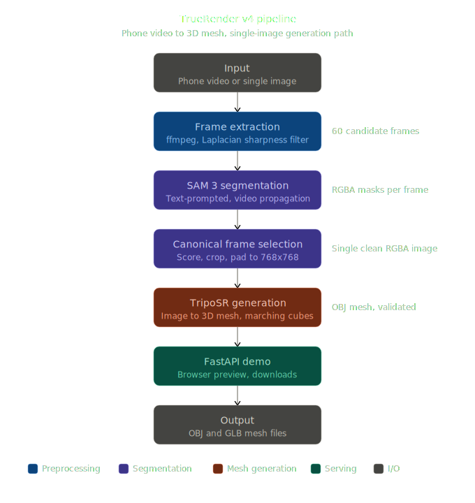
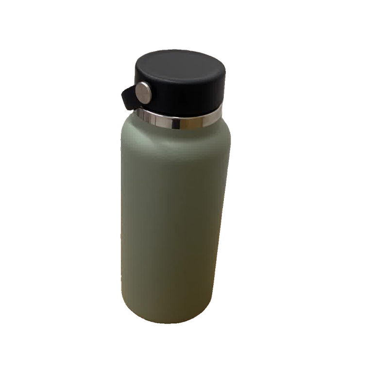
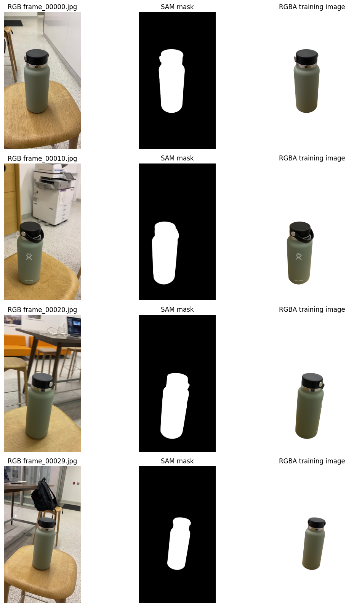
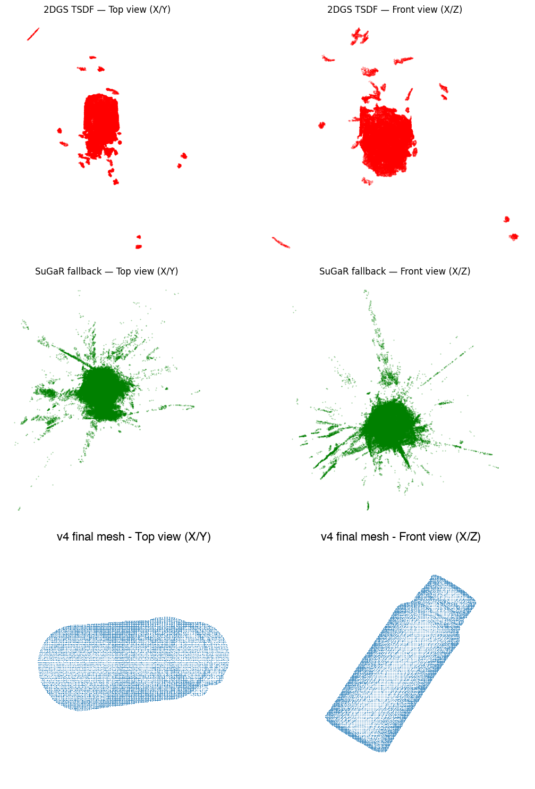

#  TrueRender

## What it Does

TrueRender investigates one project goal: can a user turn a single ordinary object photo into a usable, browser-previewable 3D asset without manual modeling or cleanup? The final system uses SAM 3 to segment the prompted object, crops a canonical RGBA input, feeds it to TripoSR for single-image 3D reconstruction, and serves downloadable OBJ/GLB outputs through a FastAPI web app. Earlier research variants explored multi-view reconstruction with COLMAP + 3DGS + SuGaR and faster VGGT + 2DGS + TSDF alternatives; the final demo uses the SAM 3 + TripoSR path because it produced cleaner meshes quickly enough for an interactive workflow.

---

## Quick Start

**Requirements:** Google Colab with an A100 GPU runtime and a [HuggingFace account](https://huggingface.co) with access to [`facebook/sam3`](https://huggingface.co/facebook/sam3).

1. Clone the repo and open `setup_colab.ipynb` in Colab.
2. Run **Cell 0** — paste your HuggingFace token when prompted.
3. Run **Cell 1** — installs all dependencies, patches SAM 3 and TripoSR, logs in to HuggingFace.
4. Run **Cell 2** — starts the FastAPI server and prints a public Cloudflare tunnel URL.
5. Open the URL, type an object prompt such as `shoe`, `bottle`, or `cup`, upload a JPG/PNG, and wait for the preview plus OBJ/GLB download links.

The UI shows progress through segmentation, cropping, mesh generation, and final preview.

---

## Video Links

- **Demo video:** TODO: add direct demo video URL before submission.
- **Technical walkthrough:** TODO: add direct technical walkthrough video URL before submission.

---

## Final Pipeline Architecture

---

## Segmentation Evidence

The final pipeline uses SAM 3 as the segmentation model before mesh generation. The image below shows the clean Hydro Flask input frame used for the single-image path, followed by the SAM 3 segmentation evidence used to isolate the object before sending it to TripoSR.

---

## Evaluation

| Pipeline | Reconstruction Quality | Runtime |
|---|---|---|
| v1: COLMAP + SAM 3 + 3DGS + SuGaR | PSNR 35.6 dB, L1 = 0.00210 at 7k iterations — usable SuGaR mesh | ~130 min total |
| v2/v3: VGGT + SAM 3 + 2DGS + TSDF | PSNR 30.6 dB, L1 = 0.00494 — failed quality gate (50 connected components) | ~12–30 min |
| v4: SAM 3 + TripoSR (final) | Clean single-component OBJ, 3.9 MB, passes geometry validation | Seconds after setup |

The evaluation outcome is qualitative as well as quantitative: v1 produced recognizable geometry but was too slow for an interactive demo, while v2/v3 improved runtime but produced fragmented TSDF meshes around masked regions. v4 avoids multi-view fusion entirely; SAM 3 isolates a clean canonical frame and TripoSR generates a coherent mesh, making it the practical answer to the project question.

Example final mesh: [`examples/meshes/meshv4_finalmeshexample_hydroflask.obj`](examples/meshes/meshv4_finalmeshexample_hydroflask.obj)

---

## Individual Contributions

| Contributor | Contributions |
|---|---|
| Emmanuel Serrano | Pipeline design and implementation (all four variants), SAM 3 integration, TripoSR integration, FastAPI demo app, Colab setup notebook, evaluation |
